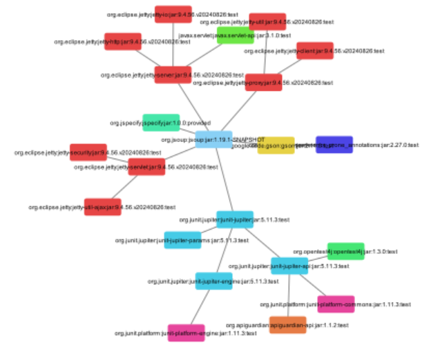

# **Visualisation_des_dependances_logicielles_JAVA**

Un plugin Maven pour visualiser les dépendances logicielles d'un projet Maven sous forme de graphes interactifs dans **Cytoscape**. Il automatise l'extraction, le traitement et la visualisation des dépendances grâce à un fichier `.dot` converti en CSV coloré.

---

## **Informations générales**

Ce projet vise à simplifier l'analyse et la gestion des dépendances logicielles en automatisant leur extraction et leur visualisation.

---

## **Fonctionnalités**

- Clonage automatique des projets Git publics.
- Génération de fichiers `.dot` pour représenter les dépendances d’un projet Maven.
- Conversion des fichiers `.dot` en CSV adaptés à Cytoscape.
- Coloration des nœuds par groupes de dépendances.
- Intégration avec Cytoscape pour visualiser les graphes interactifs.

---

## **Installation**

### **Prérequis**

- Maven installé et configuré sur votre système.
- Cytoscape installé (minimum version 3.10.3).
- Accès à un dépôt Git contenant un projet Maven.

### **Ajout du plugin au `pom.xml`**

Ajoutez le plugin comme dépendance dans votre projet Maven :

```
xml
<build>
  <plugins>
    <plugin>
      <groupId>com.dependence.plugins</groupId>
      <artifactId>cytoscape-dot-plugin</artifactId>
      <version>0.0.1-SNAPSHOT</version>
    </plugin>
  </plugins>
</build>
```

### **Utilisation**

Exécutez la commande suivante dans votre terminal ou IDE :

```
bash
mvn com.dependence.plugins:cytoscape-dot-plugin:generate-graph -DrepoUrl=<URL_du_projet_Git>
```

### **Exemple :**

```bash
mvn com.dependence.plugins:cytoscape-dot-plugin:generate-graph -DrepoUrl=https://github.com/jhy/jsoup
```

### **Résultats :**

- Un fichier `.dot` contenant les dépendances du projet.
- Un fichier CSV coloré généré automatiquement.
- Cytoscape s'ouvre avec le graphe généré.

---

## **Exemples de visualisations**

- **Projet jsoup** :

  

- **Projet GraphHopper** :

  .PNG)

---

## **Perspectives futures**

- Intégration des numéros de versions dans les graphes.
- Support d’autres outils de gestion de dépendances comme Gradle.
- Génération de graphes interactifs avec des technologies web.

---

## **Contribuer**

Les contributions sont les bienvenues ! Suivez les étapes suivantes pour contribuer :

1. **Clonez le projet :**

   ```bash
   git clone https://github.com/MarielLF/Visualisation_des_dependances_logicielles_JAVA.git
   ```
## **Liens utiles**

- [Cytoscape](https://cytoscape.org/)
- [Maven](https://maven.apache.org/)
- [Exemple de plugin Maven](https://www.baeldung.com/maven-plugin)

## **Rapport hebdomadaire**

### **Semaine 1 (01/10/2024)**

J'ai configuré le projet Maven dans Eclipse et ajouté le plugin maven-dependency-plugin au fichier pom.xml pour générer un arbre des dépendances au format .dot. J'ai initialisé Git et j'ai poussé le projet sur GitHub. J'ai également répondu aux questions du professeur concernant les projets multi-modules et l'inclusion des numéros de version dans les fichiers .dot. J'ai exploré des outils comme Graphviz, Dependency-Track et Gephi pour la visualisation des dépendances.

### **Semaine 2 (08/10/2024)**

Je me suis concentrée sur le clonage des projets Git publics et la génération des fichiers .dot. J'ai résolu des problèmes d'authentification lors du clonage de dépôts publics en désactivant les demandes de credentials. J'ai configuré Maven pour générer automatiquement les fichiers .dot et appris à visualiser les dépendances avec des outils comme Gephi. J'ai également automatisé une partie du processus, ce qui m'a donné plus de confiance pour avancer dans le projet.

### **Semaine 3 (15/10/2024)**

J'ai travaillé sur la résolution des erreurs liées à la génération de couleurs dans les nœuds du fichier .dot. J'ai ajusté le code pour que les noms des nœuds soient entourés de guillemets doubles, respectant ainsi la syntaxe de Graphviz. J'ai aussi configuré correctement Graphviz pour ouvrir automatiquement les images générées et modifié les chemins des fichiers afin d'éviter des problèmes liés à leur localisation.

### **Semaine 4 (28/10/2024)**

J'ai ajouté des couleurs aux nœuds selon leurs groupes dans le fichier .dot, en résolvant des problèmes liés aux indices de couleurs et aux variables mutables. J'ai réussi à attribuer des couleurs uniques aux groupes, ce qui a permis de générer un graphique plus clair et fonctionnel. J'ai validé les résultats en visualisant le graphique dans des outils comme Graphviz, tout en m'assurant que les relations et les couleurs étaient précises.

### **Semaine 5 (05/11/2024)**

J'ai développé un plugin Maven pour automatiser le processus d'analyse et de visualisation des dépendances. J'ai implémenté des classes pour générer des fichiers .dot, les colorer et ouvrir automatiquement les images avec Graphviz. J'ai également résolu des problèmes liés à la configuration du plugin dans Maven ainsi qu'à l'ouverture des fichiers dans Graphviz. Ces avancées m'ont permis de compléter un flux fonctionnel pour la génération et la visualisation des arbres de dépendances.

### **Semaine 6 (12/11/2024)**

J'ai exploré des outils comme Cytoscape pour améliorer l'interactivité des visualisations. J'ai également analysé les possibilités d'intégration avec des technologies web comme Rustviz et Cytoscape.js, en évaluant leurs avantages et leurs inconvénients pour mon projet.

## **Semaine 7 (19/11/2024)**

J'ai modifié le plugin pour inclure la génération de graphiques au format .csv adaptés à Cytoscape. J'ai ajusté la logique d'attribution des couleurs aux nœuds en fonction de leurs groupes et de leurs versions, ce qui a permis une meilleure différenciation dans les visualisations. J'ai validé la compatibilité des fichiers avec Cytoscape et optimisé le format final pour faciliter leur importation.

## **Semaine 8 (26/11/2024)**

J'ai rendu le plugin plus générique, permettant son utilisation avec n'importe quel dépôt Maven public. J'ai intégré la fonctionnalité d'ouverture automatique des graphiques dans Cytoscape et effectué les ajustements finaux pour garantir la flexibilité et l'efficacité du plugin.

## **Semaine 9 (03/12/2024)**

J'ai finalisé le projet en améliorant la présentation des graphiques dans Cytoscape, en appliquant un design circulaire et en ajustant l'espacement entre les nœuds. J'ai également poussé le plugin sur GitHub Packages, permettant son utilisation en tant que dépendance dans d'autres projets Maven. J'ai validé son fonctionnement avec différents dépôts et complété la documentation dans un fichier README.md.


